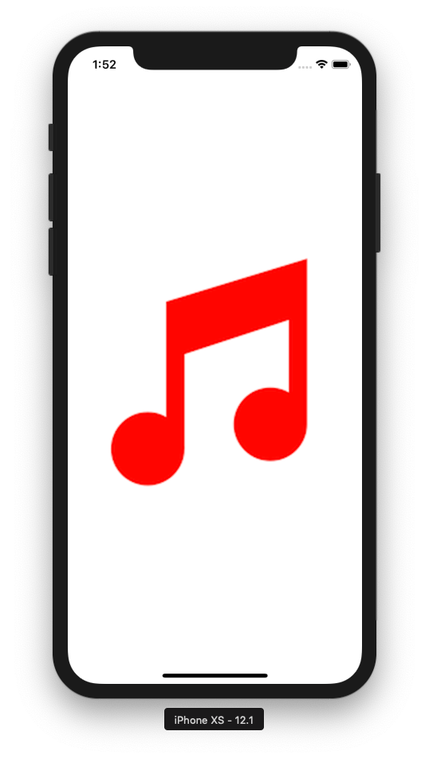
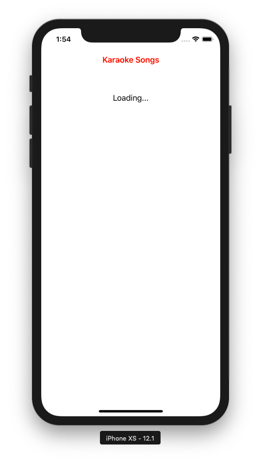
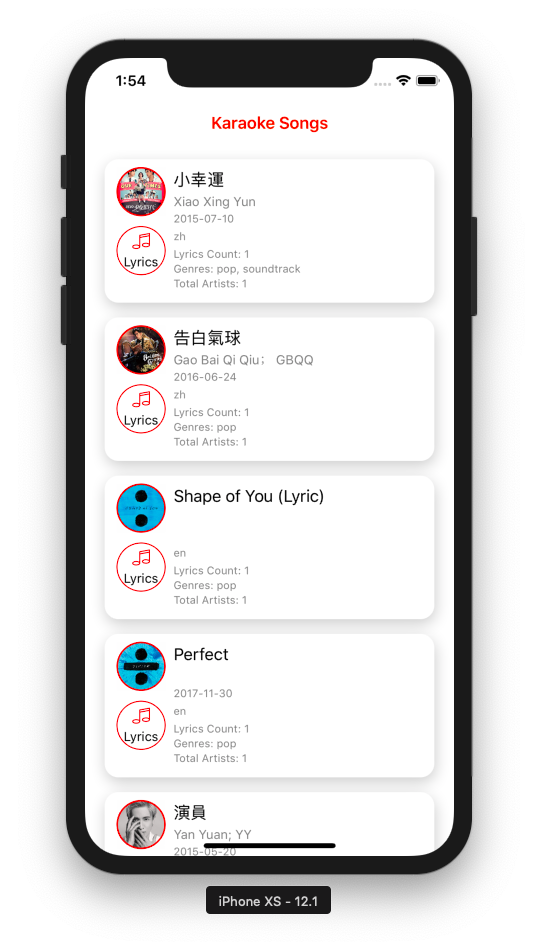
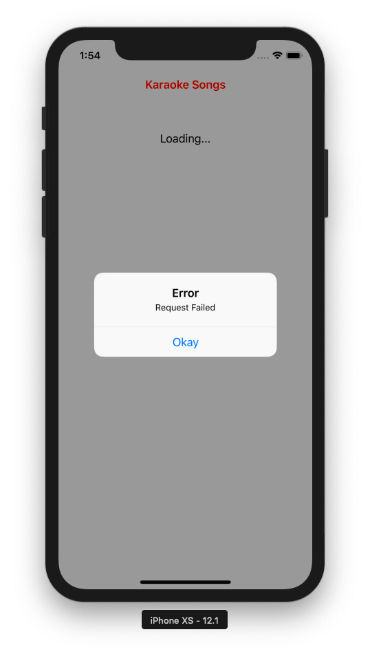

# 🎶🎷 Karaoke Songs 🎤 
iOS app showing list of Karaoke Songs from Popsical /songs.json API.

  
  
  
  

### :octocat: Prerequisite:
1. :gem: [Xcode](https://itunes.apple.com/my/app/xcode/id497799835?mt=12)
1. :gem: [Cocoapods](https://cocoapods.org/)

### :octocat: How to run and test this app:
1. :gem: Download this repo or clone it using 'git clone https://github.com/nikhilgohil11/KaraokeSongs.git' 💻
1. :gem: Open clone folder in terminal. 👨🏻‍💻
1. :gem: Now install pod by using 'pod install' command. ⌨️
1. :gem: Now open 'KaraokeSongs.xcworkspace' in Xcode.

## :

Features | Implemented 
:------------: | :-------------:
Pagination | Yes 
Pull to refresh | Yes 
Handle optional value in JSON | Yes 
API Call with Error Handling| Yes

